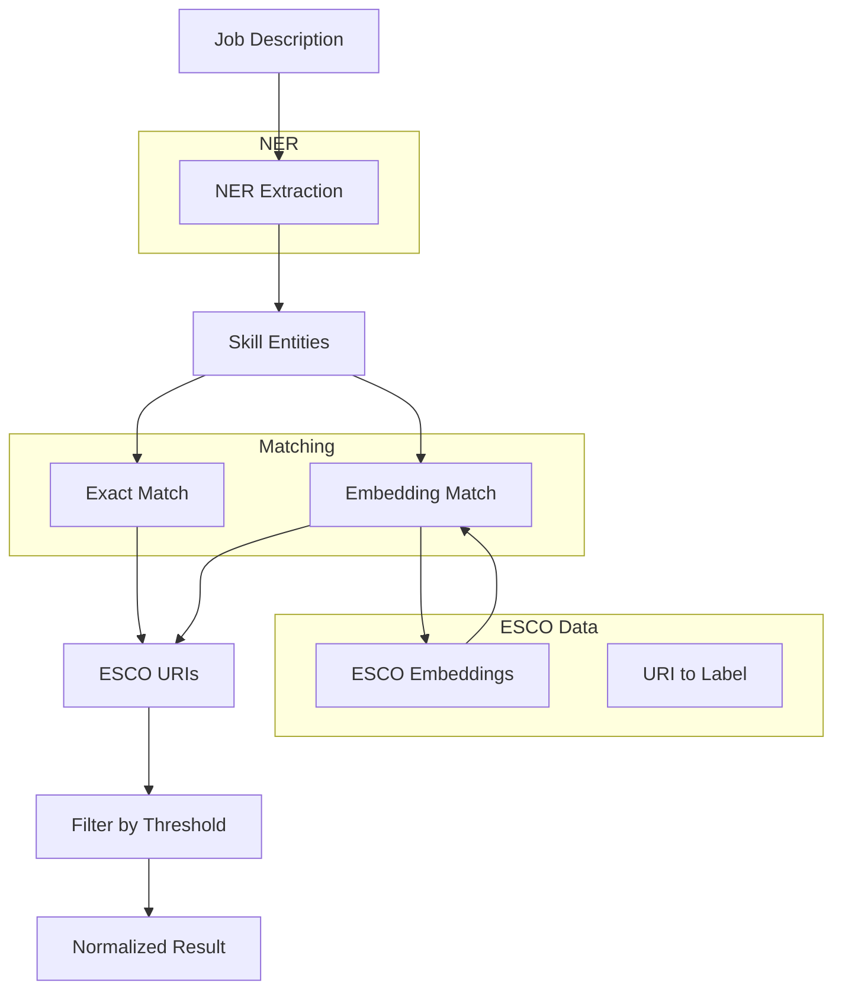

# ESCO Skill Normalization Pipeline

Documentation for the ESCO Skill Normalization Pipeline used in the Restart-35 platform.

## Overview

The ESCO Skill Normalization Pipeline extracts and normalizes skills from Vietnamese job descriptions to ESCO (European Skills, Competences, Qualifications) taxonomy URIs.

### Purpose

- Extract skills from job descriptions using Named Entity Recognition (NER)
- Match extracted skills to ESCO taxonomy using semantic similarity
- Enable skill-based job matching and recommendation

## Architecture



## Components

### 1. ESCO Normalizer (`services/esco_normalizer.py`)

Main normalization engine that:
- Loads trained spaCy NER model
- Loads ESCO embeddings for semantic matching
- Extracts skills using NER
- Matches skills to ESCO URIs

### 2. ESCO Storage Service (`services/esco_storage_service.py`)

MongoDB storage for normalized jobs:
- Stores normalized job data with ESCO URIs
- Supports querying by skill URI
- Generates statistics

### 3. API Router (`routers/esco_normalization.py`)

FastAPI endpoints for the pipeline:
- `POST /api/v1/esco/normalize` - Normalize single job
- `POST /api/v1/esco/normalize-and-store` - Normalize and store
- `GET /api/v1/esco/jobs/{job_id}` - Get stored job
- `GET /api/v1/esco/storage-stats` - Get statistics

## Usage

### Quick Start

```bash
# Install dependencies
pip install -r requirements_esco.txt

# Run API server
cd ai-service
uvicorn main:app --reload --host 0.0.0.0 --port 8000
```

### Python Usage

```python
from services.esco_normalizer import ESCONormalizer

# Initialize normalizer
normalizer = ESCONormalizer(threshold=0.75)

# Normalize a job description
result = normalizer.normalize_text(
    text="Cần người biết Python, Excel và kỹ năng giao tiếp",
    job_id="job_001",
    title="Software Developer"
)

# Access results
print(f"Total skills: {result.total_skills}")
print(f"Matched skills: {result.matched_skills}")
print(f"Match rate: {result.match_rate}")

for entity in result.entities:
    print(f"  {entity['text']} -> {entity.get('best_match', {}).get('uri', 'N/A')}")
```

### API Usage

```bash
# Normalize a job
curl -X POST "http://localhost:8000/api/v1/esco/normalize" \
  -H "Content-Type: application/json" \
  -d '{"description": "Cần người biết Python, Excel"}'

# Get storage statistics
curl "http://localhost:8000/api/v1/esco/storage-stats"
```

## Configuration

### Threshold

The similarity threshold (default: 0.75) controls match quality:
- Higher threshold = fewer but more confident matches
- Lower threshold = more matches but lower confidence

Recommended thresholds:
- Production: 0.75 - 0.80
- Development/Testing: 0.70

### ESCO Data

ESCO processed data is stored in `data/esco_processed/`:
- `esco_embeddings.npy` - Skill embeddings
- `esco_labels_order.json` - Skill labels
- `esco_uris.json` - ESCO URIs
- `esco_skills.json` - Full skill data

## Batch Processing

Process multiple jobs in batch:

```bash
cd ai-service
python scripts/batch_normalize.py --limit 1000
```

Quality check:

```bash
python scripts/quality_check.py --sample 100 --all
```

## Evaluation

Run pipeline evaluation:

```bash
python scripts/evaluate_pipeline.py --sample-size 100
```

Results are saved to `data/final_metrics.json`.

## Models

### NER Model

Trained spaCy model for skill entity recognition:
- Location: `models/skill_ner/`
- Labels: SKILL_TECHNICAL, SKILL_TOOL, SKILL_SOFT, SKILL_LANGUAGE, CERTIFICATION

### Embedding Model

Sentence transformer for semantic matching:
- Model: `intfloat/multilingual-e5-base`
- Supports Vietnamese and English

## Performance

| Metric | Value |
|--------|-------|
| Avg processing time | ~644 ms/job |
| Throughput | ~1.6 jobs/sec |
| Avg confidence | 0.86 |
| Avg skills/job | 4.98 |

## Directory Structure

```
ai-service/
├── services/
│   ├── esco_normalizer.py       # Main normalizer
│   └── esco_storage_service.py  # MongoDB storage
├── routers/
│   └── esco_normalization.py     # API endpoints
├── scripts/
│   ├── batch_normalize.py       # Batch processing
│   ├── quality_check.py          # Quality check
│   └── evaluate_pipeline.py      # Evaluation
├── models/
│   └── skill_ner/               # Trained NER model
├── data/
│   ├── esco_processed/          # ESCO embeddings
│   └── normalization_stats.json  # Statistics
└── docs/
    └── ESCO_PIPELINE_README.md  # This file
```

## License

Part of the Restart-35 Platform project.
