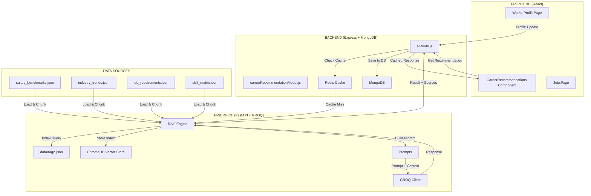

# RESTART-35 Platform - AI Career Recommendation System

## Tổng quan

Dự án này xây dựng hệ thống gợi ý chuyển hướng nghề nghiệp cho người lao động Việt Nam **trên 35 tuổi**, tích hợp RAG (Retrieval-Augmented Generation) để đảm bảo thông tin salary và trends được cập nhật và chính xác.

---

## Mục lục

1. [Kiến trúc hệ thống](#kiến-trúc-hệ-thống)
2. [RAG System](#rag-system)
3. [Prompts cho GROQ API](#prompts-cho-groq-api)
4. [Hybrid Caching Strategy](#hybrid-caching-strategy)
5. [Database Schema](#database-schema)
6. [API Endpoints](#api-endpoints)
7. [Frontend Components](#frontend-components)
8. [Cấu trúc Files](#cấu-trúc-files)
9. [Implementation Phases](#implementation-phases)

---

## Kiến trúc hệ thống



---

## RAG System

### Mục đích

RAG được sử dụng để:
1. **Cung cấp salary data chính xác** - Không hallucinate số lương
2. **Lấy industry trends 2026** - Thông tin cập nhật theo năm
3. **Personalization** - Query data phù hợp với profile từng user
4. **Traceability** - Biết được data source nào được dùng

### Cấu trúc thư mục

```
ai-service/
├── data/
│   └── rag/
│       ├── salary_benchmarks.json      # Lương theo ngành/vị trí
│       ├── industry_trends.json        # Xu hướng 2026
│       ├── job_requirements.json       # Yêu cầu công việc
│       ├── skill_matrix.json           # Ma trận kỹ năng chuyển đổi
│       ├── learning_resources.json     # Khóa học đề xuất
│       ├── career_ladders.json         # Lộ trình thăng tiến
│       └── success_cases.json          # Case studies
│
│   └── rag_index/                      # ChromaDB storage
│       └── chroma/
│
└── services/
    └── rag/
        ├── __init__.py
        ├── document_loader.py          # Load & chunk data
        ├── embedding_generator.py      # Tạo embeddings
        ├── vector_store.py             # ChromaDB wrapper
        ├── retriever.py               # Query logic
        └── rag_engine.py              # Main orchestrator
```

### Components

#### 1. Document Loader
- Load JSON files từ `data/rag/`
- Chia thành chunks có metadata (type, industry, source)
- Chunk size: ~500 tokens

#### 2. Embedding Generator
- Model: `paraphrase-multilingual-MiniLM-L12-v2`
- Hỗ trợ tiếng Việt tốt
- Encode documents khi index, encode query khi retrieve

#### 3. Vector Store (ChromaDB)
- Persistent storage tại `data/rag_index/`
- Distance metric: cosine similarity
- Support filter by metadata (type, industry)

#### 4. Retriever
- Build query từ user profile
- Retrieve top-k relevant chunks
- Format retrieved data thành context string

#### 5. RAG Engine
- Orchestrator chính
- Cung cấp `get_recommendation_context(profile)` method

---

## Prompts cho GROQ API

### Prompt chính - Career Recommendation

```python
CAREER_RECOMMEND_PROMPT = """
=== PERSONA ===
Bạn là chuyên gia HR & Career Coach hàng đầu Việt Nam, đặc biệt am hiểu
thị trường lao động cho người trên 35 tuổi tại Việt Nam.

=== NHIỆM VỤ ===
Dựa trên profile người dùng và data được cung cấp bên dưới, hãy phân tích
và đưa ra gợi ý chuyển hướng nghề nghiệp phù hợp.

=== CONTEXT TỪ RAG (DATA ĐƯỢC VERIFY - PHẢI DÙNG) ===
{rag_context}
# Ví dụ khi render:
# === SALARY BENCHMARKS ===
# HR Manager: 25-40 triệu/tháng
# === TRENDS 2026 ===
# Ngành HR đang chuyển đổi số...

=== USER PROFILE ===
Tuổi: {age}
Giới tính: {gender}
Tỉnh/Thành phố: {location}
Ngành hiện tại: {current_industry}
Vị trí hiện tại: {current_role}
Kinh nghiệm: {years_experience} năm
Kỹ năng hiện tại: {skills}
Rào cản: {barriers}
Mục tiêu: {goal}

=== RULES ===
1. SALARY: Chỉ dùng data từ phần CONTEXT, không tự bịa số
2. Nếu thiếu data: Nói rõ "Data chưa có thông tin, dựa trên general knowledge..."
3. Đưa ra ít nhất 3 gợi ý cụ thể, có salary, learning path
4. Ưu tiên những nghề phù hợp với age {age} và có thể học trong 3-6 tháng

=== OUTPUT FORMAT ===
Trả lời bằng tiếng Việt, định dạng JSON với cấu trúc:
{{
  "best_fits": [...],      # 3-5 nghề phù hợp nhất
  "income_boost": [...],   # Nghề tăng thu nhập nhanh
  "progression": [...]     # Lộ trình thăng tiến
}}
"""
```

### Prompt phụ - Startup Suggestions

```python
STARTUP_PROMPT = """
=== PERSONA ===
Bạn là chuyên gia tư vấn khởi nghiệp cho người có kinh nghiệm 10+ năm.

=== CONTEXT ===
{rag_context}

=== USER PROFILE ===
Tuổi: {age}
Kinh nghiệm: {years_experience} năm trong ngành {current_industry}
Kỹ năng: {skills}
Rào cản: {barriers}
Vốn dự kiến: {budget}

=== NHIỆM VỤ ===
Đề xuất 3 ý tưởng khởi nghiệp phù hợp với profile trên.
Ưu tiên những mô hình có thể bắt đầu với vốn {budget} và tận dụng kinh nghiệm.

=== RULES ===
1. Mỗi ý tưởng phải có: tên, mô tả, vốn cần, thời gian triển khai, lợi nhuận dự kiến
2. Cân nhắc sức khỏe và cuộc sống gia đình (tuổi {age})
3. Đề xuất cách tận dụng kinh nghiệm hiện tại
"""
```

### Prompt phụ - Skills Gap Analysis

```python
SKILLS_GAP_PROMPT = """
=== PERSONA ===
Bạn là chuyên gia phân tích kỹ năng, giúp người đi làm nâng cấp profile.

=== CONTEXT ===
{rag_context}

=== USER PROFILE ===
Tuổi: {age}
Ngành: {current_industry}
Kỹ năng hiện tại: {skills}
Mục tiêu: {goal}

=== NHIỆM VỤ ===
1. Phân tích kỹ năng "endangered" (sắp bị thay thế bởi AI/tự động hóa)
2. Đề xuất kỹ năng "future-proof" cần học
3. Tạo lộ trình học 3-6 tháng, phù hợp với người đi làm bận rộn

=== OUTPUT FORMAT ===
{{
  "endangered_skills": [...],     # Kỹ năng đang mất giá
  "must_learn_skills": [...],     # Kỹ năng cần học ngay
  "future_proof_skills": [...],   # Kỹ năng an toàn tương lai
  "learning_path": [...]          # Lộ trình cụ thể
}}
"""
```

---

## Hybrid Caching Strategy

### Ý tưởng: Cache ở 2 levels

```
┌─────────────────────────────────────────────────────────────┐
│                     CACHE HIERARCHY                         │
├─────────────────────────────────────────────────────────────┤
│                                                              │
│  Level 1: Redis (Frontend ↔ Backend)                       │
│  ─────────────────────────────────────────────────────────  │
│  • Cache response từ AI service                             │
│  • TTL: 7 ngày                                              │
│  • Instant response khi cache hit                          │
│                                                              │
│  Level 2: MongoDB (Backend)                                 │
│  ─────────────────────────────────────────────────────────  │
│  • Lưu profile snapshot + results                          │
│  • Có thể query lịch sử                                    │
│  • Persistent storage                                       │
│                                                              │
│  Level 3: RAG Index (AI Service)                           │
│  ─────────────────────────────────────────────────────────  │
│  • Pre-computed embeddings                                  │
│  • Rebuild khi data files thay đổi                        │
│                                                              │
└─────────────────────────────────────────────────────────────┘
```

### Cache Invalidation Strategy

| Event | Action |
|-------|--------|
| Profile update | Invalidate Redis, mark MongoDB as stale |
| Manual refresh | Regenerate, update MongoDB, refresh Redis |
| Auto-refresh | Trigger background regeneration nếu expired |
| Data file update | Rebuild RAG index, clear all caches |

### Rate Limiting

- **Generate mới:** Max 1 lần/ngày
- **Refresh:** Max 1 lần/24h
- **Auto-refresh:** Khi data expired (>7 ngày)

---

## Database Schema

### MongoDB Collection: `career_recommendations`

```javascript
{
  _id: ObjectId,

  // User reference
  userId: String,

  // Profile snapshot tại thời điểm generate
  profile_snapshot: {
    age: Number,
    gender: String,
    location: String,
    current_industry: String,
    current_role: String,
    years_experience: Number,
    skills: [String],
    barriers: [String],
    goal: String
  },

  // AI Recommendations (from GROQ)
  careerPath: Mixed,           // Existing data
  careerTransitions: Mixed,     // Existing data

  // NEW: RAG-based recommendations
  rag_recommendations: {
    best_fits: [{
      job_title: String,
      match_score: Number,        // 0-1
      salary_range: String,        // "20-30 triệu"
      learning_path: [String],
      timeline: String,            // "3-6 tháng"
      sources: [String]            // ["salary_benchmarks"]
    }],
    income_boost: Mixed,
    progression: Mixed,
    salary_context: String,        // Từ RAG retrieval
    trends_context: String,        // Từ RAG retrieval
    sources: [String]              // Data sources used
  },

  // Metadata
  generated_at: Date,
  expires_at: Date,              // generated_at + 7 days
  status: String,                 // "active" | "stale" | "generating"
  version: Number,
  refresh_count: Number,
  last_refresh_at: Date,
  rag_sources: [String]           // ["salary_benchmarks", "industry_trends"]
}
```

---

## API Endpoints

### Backend (Express) - `backend/src/routes/v1/aiRoute.js`

```javascript
// POST /v1/ai/career-recommendation/rag
// Trigger RAG-based career recommendation
POST /v1/ai/career-recommendation/rag
Body: { user_id: string }
Response: { rag_recommendations: {...}, sources: [...] }

// GET /v1/ai/career-recommendation/:user_id
// Get cached recommendation
GET /v1/ai/career-recommendation/:user_id
Response: { data: {...}, meta: { last_updated, is_fresh } }

// POST /v1/ai/career-recommendation/:user_id/refresh
// Manual refresh
POST /v1/ai/career-recommendation/:user_id/refresh
Response: { status: "refreshing" }
```

### AI Service (FastAPI) - `ai-service/routers/career_recommendation.py`

```python
// POST /api/career-recommendation/rag
// RAG-based recommendation với salary & trends
POST /api/career-recommendation/rag
Body: { profile: {...}, include_salary: bool, include_trends: bool }
Response: { best_fits: [...], income_boost: [...], sources: [...] }

// GET /api/career-recommendation/sources
// Get available data sources
GET /api/career-recommendation/sources
Response: { sources: [...], last_updated: string }
```

---

## Frontend Components

### Trang chính

| Component | File | Description |
|-----------|------|-------------|
| WorkerProfilePage | `pages/WorkerProfilePage.jsx` | Multi-step profile form (4 steps) |
| CareerRecommendations | `components/worker-profile/CareerRecommendations.jsx` | Display career recommendations |
| CareerTransitions | `components/worker-profile/CareerTransitions.jsx` | Career transitions for 35+ |

### Redux Slices

| Slice | File | Purpose |
|-------|------|---------|
| `profileSlice` | `redux/profile/profileSlice.js` | Worker profile state, autosave |
| `aiSlice` | `redux/ai/aiSlice.js` | Career paths, recommendations |
| `jobSlice` | `redux/job/jobSlice.js` | Job listings |

### API Layer

| API | File | Functions |
|-----|------|-----------|
| `aiAPI` | `apis/aiAPI.js` | `discoverCareerPathAPI`, `getCareerTransitionsAPI` |
| `profileAPI` | `apis/profileAPI.js` | `fetchMyProfile`, `createProfile`, `saveStep` |

### UI Flow

```
WorkerProfilePage (Step 4 - Aspirations)
        │
        ▼
[Save Profile] ──► Triggers career path generation
        │
        ▼
CareerRecommendations Component
        │
        ├── Tab: Management Track
        ├── Tab: Age Transition
        ├── Tab: Skill Upgrades
        └── NEW: Tab: RAG Data 📊
                    │
                    ├── Salary benchmarks
                    ├── Industry trends
                    └── Sources list
```

---

## Cấu trúc Files

### Files cần TẠO MỚI

```
ai-service/
├── data/
│   └── rag/
│       ├── salary_benchmarks.json      ✅ TẠO MỚI
│       ├── industry_trends.json        ✅ TẠO MỚI
│       ├── job_requirements.json       ✅ TẠO MỚI
│       ├── skill_matrix.json           ✅ TẠO MỚI
│       ├── learning_resources.json     ✅ TẠO MỚI
│       ├── career_ladders.json         ✅ TẠO MỚI
│       └── success_cases.json          ✅ TẠO MỚI
│
│   └── rag_index/                      ✅ TẠO MỚI
│
├── services/
│   └── rag/
│       ├── __init__.py                 ✅ TẠO MỚI
│       ├── document_loader.py         ✅ TẠO MỚI
│       ├── embedding_generator.py      ✅ TẠO MỚI
│       ├── vector_store.py             ✅ TẠO MỚI
│       ├── retriever.py                ✅ TẠO MỚI
│       └── rag_engine.py               ✅ TẠO MỚI
│
├── routers/
│   └── career_recommendation.py       ✅ TẠO MỚI
│
├── scripts/
│   └── build_rag_index.py              ✅ TẠO MỚI
│
└── prompts/
    ├── __init__.py                     ✅ TẠO MỚI
    ├── career_recommend.py             ✅ TẠO MỚI
    ├── startup_suggestion.py           ✅ TẠO MỚI
    └── skills_gap.py                   ✅ TẠO MỚI
```

### Files cần MODIFY

```
ai-service/
├── requirements.txt                    ⚠️ ADD: chromadb, sentence-transformers
├── main.py                             ⚠️ ADD: RAG router, startup event

backend/
├── src/
│   └── models/
│       └── careerRecommendationModel.js  ⚠️ ADD: rag_recommendations fields
│   └── routes/
│       └── v1/
│           └── aiRoute.js              ⚠️ ADD: /rag endpoint

frontend/
└── src/
    ├── redux/
    │   └── ai/
    │       └── aiSlice.js             ⚠️ ADD: RAG state/thunks
    └── components/
        └── worker-profile/
            └── CareerRecommendations.jsx  ⚠️ ADD: RAG tab
```

---

## Sample Data

### salary_benchmarks.json

```json
{
  "hanh_chinh": {
    "thu_ky": {
      "salary_range": "8-12 triệu",
      "senior_range": "12-18 triệu",
      "locations": {
        "HCM": "+20%",
        "HN": "+15%",
        "tinh": "base"
      }
    },
    "truong_phong_hanh_chinh": {
      "salary_range": "18-25 triệu",
      "senior_range": "25-40 triệu"
    }
  },
  "nhan_su": {
    "hr_manager": {
      "salary_range": "25-40 triệu",
      "senior_range": "40-60 triệu"
    },
    "hr_director": {
      "salary_range": "50-80 triệu",
      "senior_range": "80-120 triệu"
    }
  },
  "it": {
    "data_analyst": {
      "salary_range": "18-35 triệu",
      "senior_range": "35-60 triệu"
    },
    "project_manager": {
      "salary_range": "25-45 triệu",
      "senior_range": "45-80 triệu"
    }
  }
}
```

### industry_trends.json

```json
{
  "2026_trends": {
    "dang_tang": [
      "AI/Machine Learning Engineer",
      "Digital Marketing & E-commerce",
      "Data Analyst/Scientist",
      "Logistics & Supply Chain",
      "Healthcare Technology"
    ],
    "dang_giam": [
      "Data Entry cơ bản",
      "Telesales không chuyên môn",
      "Kế toán đơn giản"
    ],
    "xuat_hien_moi": [
      "AI Prompt Engineer",
      "UX Writer",
      "E-commerce Operations"
    ]
  },
  "hanh_chinh": {
    "trend": "Chuyển đổi số mạnh mẽ, tự động hóa",
    "growth_rate": "-10% nhu cầu",
    "advice": "Chuyển sang HR Analytics, Digital Transformation"
  },
  "nhan_su": {
    "trend": "HRBP là xu hướng chính, data-driven decisions",
    "growth_rate": "+5% cho HR có kỹ năng phân tích",
    "advice": "Học HR Analytics, People Analytics, Digital HR Tools"
  },
  "it": {
    "trend": "AI hỗ trợ lập trình, low-code platforms",
    "growth_rate": "+20% nhu cầu AI-related roles",
    "advice": "Học Python, AI/ML basics, Cloud computing"
  }
}
```

---

## Implementation Phases

### Phase 1: RAG Infrastructure (Day 1)
- [ ] Tạo `data/rag/` directory
- [ ] Tạo sample data files (2 files đơn giản)
- [ ] Setup ChromaDB + dependencies
- [ ] Implement document_loader.py
- [ ] Implement embedding_generator.py
- [ ] Implement vector_store.py
- [ ] Test retrieval đơn giản

**Deliverable:** Có thể query data và lấy context

### Phase 2: End-to-end Prototype (Day 2-3)
- [ ] Implement retriever.py
- [ ] Implement rag_engine.py
- [ ] Tạo career_recommendation.py router
- [ ] Kết nối với GROQ client
- [ ] Build test prompt với RAG context
- [ ] Test full flow

**Deliverable:** Working prototype, có thể test manual

### Phase 3: Backend Integration (Day 4-5)
- [ ] Cập nhật careerRecommendationModel.js
- [ ] Tạo /rag endpoint trong aiRoute.js
- [ ] Kết nối với existing profile system
- [ ] Test với Postman/curl

**Deliverable:** Backend hoàn chỉnh

### Phase 4: Frontend + Polish (Day 6-7)
- [ ] Update aiAPI.js
- [ ] Update aiSlice.js
- [ ] Update CareerRecommendations.jsx (add RAG tab)
- [ ] Thêm data files đầy đủ
- [ ] Performance optimization
- [ ] Bug fixes

**Deliverable:** Sản phẩm hoàn chỉnh

---

## Dependencies

```txt
# ai-service/requirements.txt - THÊM
chromadb==0.4.22
sentence-transformers==2.2.2
```

---

## Configuration

### Environment Variables

```bash
# ai-service/.env
GROQ_API_KEY=gsk_...
GEMINI_API_KEY=...
LLM_PROVIDER=groq

# backend/.env
MONGODB_URI=mongodb+srv://...
REDIS_URL=redis://...
AI_SERVICE_URL=http://localhost:8000
```

---

## Workflow đầy đủ

```
┌─────────────────────────────────────────────────────────────────────────┐
│                    COMPLETE WORKFLOW                                     │
├─────────────────────────────────────────────────────────────────────────┤
│                                                                          │
│  [EVENT: User Create/Update Profile]                                    │
│                    │                                                     │
│                    ▼                                                     │
│  ┌──────────────────────────────────────┐                               │
│  │ 1. Profile saved to MongoDB          │                               │
│  │ 2. Trigger: POST /career/recommend  │                               │
│  │ 3. Create "pending" record          │                               │
│  └──────────────────────────────────────┘                               │
│                    │                                                     │
│                    ▼                                                     │
│  ┌──────────────────────────────────────┐                               │
│  │ 4. Backend → AI Service (RAG)       │                               │
│  │    - Retrieve salary context         │                               │
│  │    - Retrieve trends context         │                               │
│  │    - Build prompt with context      │                               │
│  └──────────────────────────────────────┘                               │
│                    │                                                     │
│                    ▼                                                     │
│  ┌──────────────────────────────────────┐                               │
│  │ 5. AI Service → GROQ API             │                               │
│  │    - Send prompt + RAG context       │                               │
│  │    - Get JSON response              │                               │
│  └──────────────────────────────────────┘                               │
│                    │                                                     │
│                    ▼                                                     │
│  ┌──────────────────────────────────────┐                               │
│  │ 6. Save to MongoDB                   │                               │
│  │    - rag_recommendations field       │                               │
│  │    - generated_at, expires_at        │                               │
│  └──────────────────────────────────────┘                               │
│                                                                          │
│  ────────────────────────────────────────────────────────────────────── │
│                                                                          │
│  [EVENT: User visits Career Recommendation Page]                         │
│                    │                                                     │
│                    ▼                                                     │
│  ┌──────────────────────────────────────┐                               │
│  │ 1. GET /career/recommendation/{id}  │                               │
│  │ 2. Check Redis cache                │                               │
│  │ 3. If miss: load from MongoDB      │                               │
│  │ 4. Return with metadata            │                               │
│  └──────────────────────────────────────┘                               │
│                                                                          │
└─────────────────────────────────────────────────────────────────────────┘
```

---

## Benefits của RAG approach

| Benefit | Description |
|---------|-------------|
| **Accurate Salary** | Data từ verified JSON, không hallucinate |
| **Up-to-date Trends** | Dễ update data files theo năm mới |
| **Traceable** | Biết được source nào được dùng |
| **Cost-effective** | Embed 1 lần, query nhiều lần |
| **Personalized** | Retrieve data phù hợp với từng profile |
| **Fallback** | Nếu RAG miss, vẫn có LLM fallback |

---

## Status

- [x] Architecture designed
- [x] Data structure defined
- [x] Prompts prepared
- [x] Phase 1: RAG Infrastructure - **Completed** ✅
- [x] Phase 2: End-to-end Prototype - **Completed** ✅
- [x] Phase 3: Backend Integration - **Completed** ✅
- [x] Phase 4: Frontend + Backend Integration & Automated Testing - **Completed** ✅

---

## Phase 4: Implementation Summary

### Completed Tasks

| Task | Status | File |
|------|--------|------|
| Add 5 RAG API functions to aiAPI.js | ✅ | `frontend/src/apis/aiAPI.js` |
| Add RAG state/thunks/selectors to aiSlice.js | ✅ | `frontend/src/redux/ai/aiSlice.js` |
| Refactor CareerRecommendations.jsx to use RAG data | ✅ | `frontend/src/components/worker-profile/CareerRecommendations.jsx` |
| Create aiSlice.test.js with unit tests | ✅ | `frontend/src/__tests__/aiSlice.test.js` |
| Create ragIntegration.test.js with backend tests | ✅ | `backend/src/__tests__/ragIntegration.test.js` |
| Create test_rag_prompts.py for AI service | ✅ | `ai-service/tests/test_rag_prompts.py` |
| Create integration_test.sh for E2E testing | ✅ | `scripts/integration_test.sh` |
| Update PROJECT_DOCUMENTATION.md status | ✅ | `docs/PROJECT_DOCUMENTATION.md` |

### API Functions Added

```javascript
// RAG Career Recommendation APIs (aiAPI.js)
triggerRAGCareerRecommendationAPI(profile)     // POST /v1/ai/rag/career-recommendation
getCachedRAGRecommendationAPI()               // GET /v1/ai/rag/career-recommendation
refreshRAGRecommendationAPI(profile)           // POST /v1/ai/rag/career-recommendation/refresh
getRAGSourcesAPI()                            // GET /v1/ai/rag/sources
getRAGHealthAPI()                             // GET /v1/ai/rag/health
```

### Redux State Added

```javascript
// RAG State (aiSlice.js)
ragRecommendation                              // { best_fits, income_boost, progression }
ragLoading                                     // boolean
ragError                                       // string | null
ragSources                                     // string[]
ragHealth                                     // object
ragGeneratedAt                                 // ISO timestamp
ragRefreshCount                                // number
ragExpiresAt                                   // ISO timestamp
ragIsFresh                                     // boolean
ragIsExpired                                   // boolean

// RAG Thunks
triggerRAGRecommendation                       // POST /v1/ai/rag/career-recommendation
fetchCachedRAGRecommendation                   // GET /v1/ai/rag/career-recommendation
refreshRAGRecommendation                       // POST /v1/ai/rag/career-recommendation/refresh
fetchRAGSources                                // GET /v1/ai/rag/sources
fetchRAGHealth                                 // GET /v1/ai/rag/health

// RAG Selectors
selectRAGRecommendation, selectRAGLoading, selectRAGError
selectRAGSources, selectRAGHealth, selectRAGGeneratedAt
selectBestFits, selectIncomeBoost, selectProgression
```

### Test Commands

```bash
# Frontend tests
cd frontend && npm test -- --testPathPattern=aiSlice

# Backend tests (requires Jest setup)
cd backend && npm test -- --testPathPattern=ragIntegration

# AI Service tests
cd ai-service && python -m pytest tests/

# E2E integration
bash scripts/integration_test.sh
```

---

*Document created: 2026-05-12*
*Last updated: 2026-05-12 (Phase 4 completed)*
